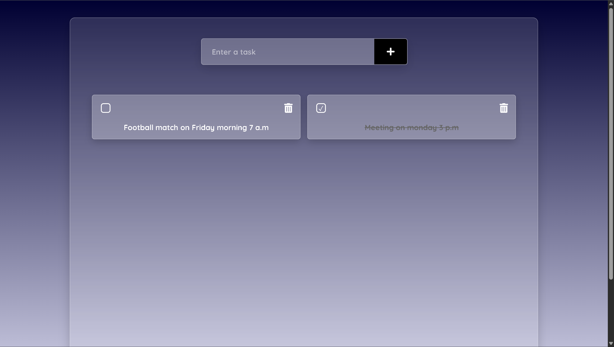

# 🌐 Portfolio Website


A full-stack MERN ToDo application built by Jaimin Patel. Users can add, delete, and toggle tasks through a clean, responsive interface. The app uses React for the frontend, Express and MongoDB for the backend, and follows a modular, RESTful architecture. It’s designed to be simple, scalable, and ideal for showcasing full-stack development skills.

---

## 👤 Author

**Jaimin Patel**  
Location: Gujarat, India  
GitHub: [Jpatel-11](https://github.com/Jpatel-11)

---

## 🧰 Tech Stack

| Layer          | Technology                   |
|----------------|------------------------------|
| Frontend       | React, Axios, CSS Modules    |
| Backend        | Node.js, Express             |
| Database       | MongoDB, Mongoose            |

---

## ✨ Features

- 📝 **Add Todos**: Create new tasks with a simple form
- ✅ **Toggle Completion**: Mark tasks as done or undone  
- 🗑️ **Delete Tasks**: Remove tasks from the list
- 🔄 **Persistent Storage**: All data saved in MongoDB
- 📱 **Responsive Design**: Works on mobile and desktop
- 🔧 **Modular Components**: Clean separation of UI logic

---

## 🎥 Demo



🎬 [Click to watch the full demo video](./demo/Todo-Demo.mp4)

---

## 🚀 Getting Started

### 1. Clone the repository

```bash
git clone https://github.com/Jpatel-11/Todo-App.git
cd Todo-App
```

---

### 2. Install dependencies
### Backend
```bash
cd backend
npm install
```
### Frontend
```bash
cd ../frontend
npm install
```

---

### 3. Configure environment variables
### Create a `.env` file inside the `backend/` folder:
```bash
MONGO_URI=your_mongodb_connection_string
```

---

### 4. Run the application
### Backend
```bash
npm start
```
### Frontend (in a separate terminal)
```bash
npm start
```

---

### Folder Structure
```plaintext
Root
TODO-APP/
├── backend/
│   ├── models/
│   │   └── Todo.js
│   ├── routes/
│   │   └── todo.js
│   ├── server.js
│   ├── package.json
│   └── package-lock.json
├── frontend/
│   ├── public/
│   │   ├── index.html
│   │   ├── manifest.json
│   │   └── robots.txt
│   ├── src/
│   │   ├── components/
│   │   │   ├── AddTodo.js
│   │   │   ├── Todo.css
│   │   │   └── TodoList.js
│   │   ├── App.css
│   │   ├── App.js
│   │   ├── index.css
│   │   ├── index.js
│   │   └── logo.svg
│   ├── package.json
│   ├── package-lock.json
│   └── .gitignore
├── demo/
│   ├── Demo-Thumbnail.png
│   └── Todo-Demo.mp4
├── .gitignore
└── README.md
```

---

## 🌐 Deployment
You can deploy:
-	Frontend to Vercel or Netlify
- 	Backend to Render or Railway
Make sure to configure environment variables securely in your hosting dashboard.

---

## 📬 Contact
Feel free to reach out for collaboration, feedback, or just to connect:

- GitHub: [Jpatel-11](https://github.com/Jpatel-11)
- LinkedIn: [Jaimin Patel](https://www.linkedin.com/in/jaimin-patel-b2a7a0344)

---